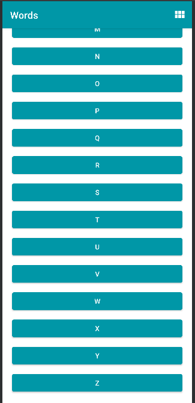
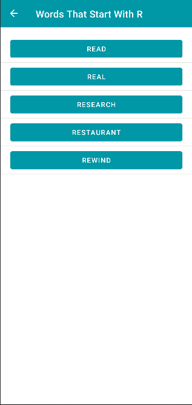
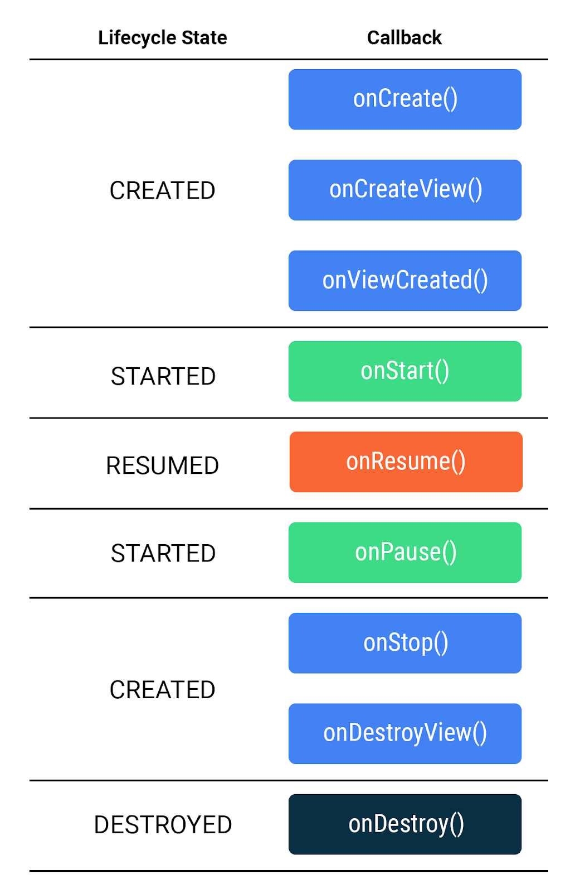
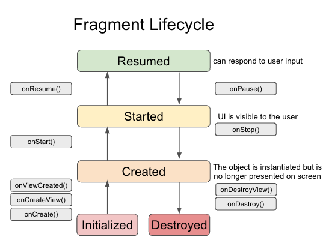

Words App
=========

# Description
Words app allows you to select a letter and use Intents to navigate to an Activity that
presents a number of words starting with that letter. Each word can be looked up via a web search.

Words app contains a scrollable list of 26 letters A to Z in a RecyclerView. The orientation
of the RecyclerView can be changed between a vertical list or a grid of items.

The app demonstrates the use of Intents in two ways:
* to navigate inside an app by specifying an explicit destination, and,
* allowing Android to service the Intent using the apps and resources present on the device.

Project sourced from:
- [Fragments and the Navigation Component](https://developer.android.com/codelabs/basic-android-kotlin-training-fragments-navigation-component)
- Starter code for the independent project for [google-developer-training/android-basics-kotlin-words-app](https://github.com/google-developer-training/android-basics-kotlin-words-app/tree/activities).

### Screenshots
Screenshots of the project

#### Letter Fragment

#### Word Fragment

## Concepts

### Fragment
A fragment is a reusable piece of UI; fragments can be reused and embedded in one or more
activities.
- switching tabs simply swaps out the previous fragment with another fragment. All of this
  happens without launching another activity.
- You can even show multiple fragments at once on a single screen
  - fragments exist simultaneously in the same activity
    - Each fragment manages its own separate lifecycle
- A fragment is simply a reusable piece of your app's user interface
- fragments have a lifecycle and can respond to user input
- A fragment is always contained within the view hierarchy of an activity when it is shown onscreen
- fragments' views can be created and destroyed several times throughout the fragment's lifecycle
- Use cases for fragments:
  - Using the Navigation component, many apps can manage their entire layout within a single
  activity, with all navigation occurring between fragments.
  - Fragments make common layout patterns possible, such as master-detail layouts on tablets,
  or multiple tabs within the same activity.

#### Fragment lifecycle
the fragment lifecycle has five states, represented by the Lifecycle.State enum.

- INITIALIZED: A new instance of the fragment has been instantiated.
- CREATED: The first fragment lifecycle methods are called. During this state, the view associated
  with the fragment is also created.
- STARTED: The fragment is visible onscreen but does not have "focus", meaning it can't respond to
  user input.
- RESUMED: The fragment is visible and has focus.
- DESTROYED: The fragment object has been de-instantiated.

#### Fragment Methods

- onCreate(): The fragment has been instantiated and is in the CREATED state. However, its
  corresponding view has not been created yet.
  - is called before the view is created, can't inflate the layout here
- onCreateView(): This method is where you inflate the layout. The fragment has entered the
  CREATED state.
- onViewCreated(): This is called after the view is created. In this method, you would typically
  bind specific views to properties by calling findViewById().
- onStart(): The fragment has entered the STARTED state.
- onResume(): The fragment has entered the RESUMED state and now has focus (can respond to user
  input).
- onPause(): The fragment has re-entered the STARTED state. The UI is visible to the user
- onStop(): The fragment has re-entered the CREATED state. The object is instantiated but is no
  longer presented on screen.
- onDestroyView(): Called right before the fragment enters the DESTROYED state. The view has
  already been removed from memory, but the fragment object still exists.
- onDestroy(): The fragment enters the DESTROYED state.

- onCreateOptionsMenu(): While the Activity class has a global property called menuInflater,
Fragment does not have this property. The menu inflater is instead passed into
onCreateOptionsMenu(). Also note that the onCreateOptionsMenu() method used with fragments
doesn't require a return statement.

How the fragment lifecycle differs from the activity lifecycle.
How to convert an existing activity into a fragment.
How to add destinations to a navigation graph, and pass data between fragments while using the Safe Args plugin.

### ?
- null safety

### !!
- certain a value won't be null when you access it, you can append !! to its type name

### get()
- get() means this property is "get-only". That means you can get the value, but once assigned
(as it is here), you can't assign it to something else

### Navigation component
Navigation component to help you handle any navigation implementation, simple or complex, in your
app. The Navigation component has three key parts which you'll use to implement navigation in this
app.
- refers to the collection of tools for implementing navigation, particularly between fragments.

#### Navigation Graph
The navigation graph is an XML file that provides a visual representation of navigation in your
app. The file consists of destinations which correspond to individual activities and fragments as
well as actions between them which can be used in code to navigate from one destination to
another. Just like with layout files, Android Studio provides a visual editor to add destinations
and actions to the navigation graph.
- visual editor to help implement navigation between fragments
- can be represented by an XML file showing how each destination relates to one another.
- actually creates a new instance of the NavGraph class
  - destinations from the navigation graph are displayed to the user by the FragmentContainerView
- Once complete, need to build project via  Build > Rebuild Project 
- Setting the navGraph attribute of a FragmentContainerView allows you to navigate between
fragments within an activity.

##### FragmentContainerView
- all the navigation in the app will take place within the FragmentContainerView
- is used to embed fragments in other activities and can manage navigation between fragments.

##### short-circuit evaluation
- a nice little programming trick
- in MainActivity, onSupportNavigateUp is using navigateUp(), might fail, it returns a Boolean for
whether or not it succeeds. However, you only need to call super.onSupportNavigateUp() if
navigateUp() returns false. This works because of the || operator only requires one of the
conditions to be true, so if navigateUp() returns true, the right side of the || expression is
never executed. If, however, navigateUp() is false, then the implementation in the parent class
is called.

#### NavHost
A NavHost is used to display destinations from a navigation graph within an activity. When you
navigate between fragments, the destination shown in the NavHost is updated. You'll use a
built-in implementation, called NavHostFragment, in your MainActivity.

#### NavController
The NavController object lets you control the navigation between destinations displayed in the
NavHost. When working with intents, you had to call startActivity to navigate to a new screen.
With the Navigation component, you can call the NavController's navigate() method to swap the
fragment that's displayed. The NavController also helps you handle common tasks like responding
to the system "up" button to navigate back to the previously displayed fragment.

### Safe Args
Gradle plugin that will assist you with type safety when passing data between fragments.

### Bundle
- Think of it as a key-value pair used to pass data between classes, such as activities and
fragments

## How to run Script locally

This sample uses the Gradle build system.

To build this project, use the "gradlew build" command or use "Import Project" in Android Studio.

## About the Developer
Jessica Dene Earley-Cha    
[Bio](https://www.jessicadeneearley-cha.com/jessica)   
[Linkedin](https://www.linkedin.com/in/jessicaearley)    